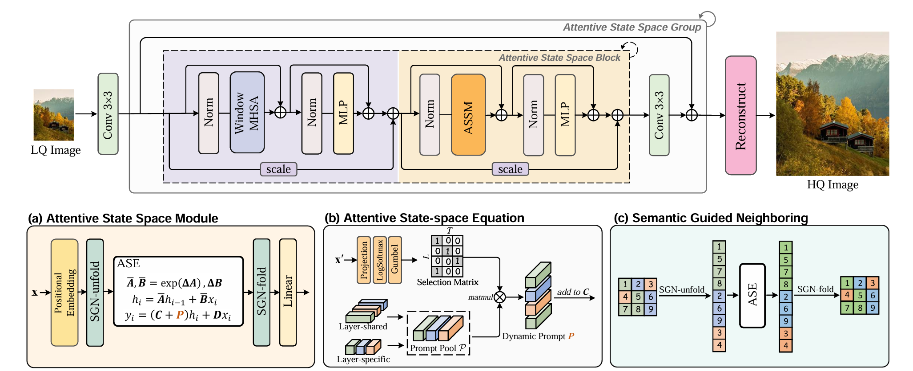
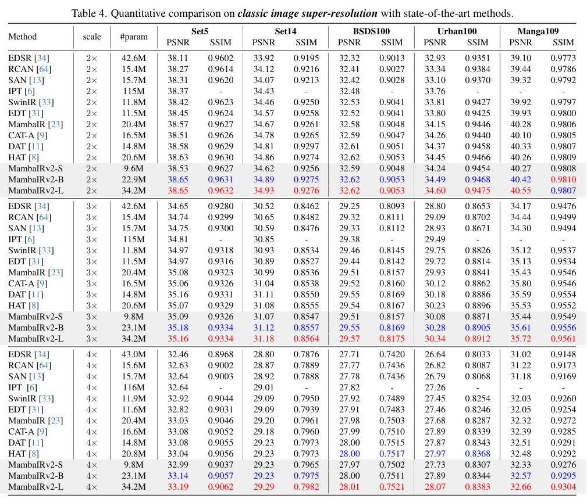
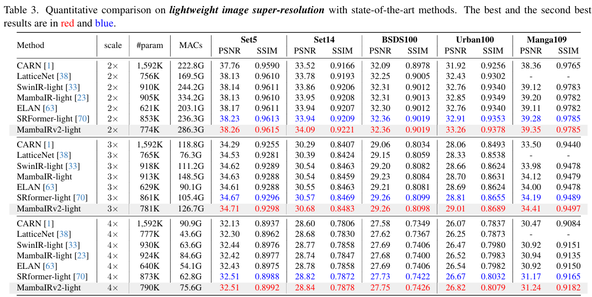
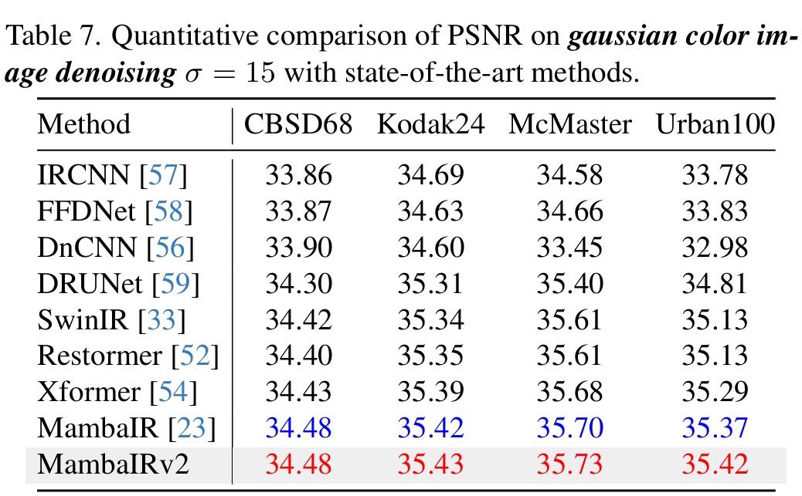
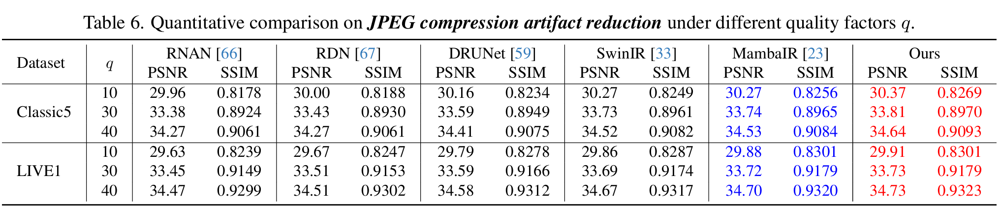
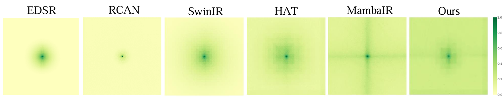

## Spatial-Frequency Integrated Mamba for Low-light Image Enhancement


> **Abstract:**   Low-light image enhancement (LLIE) is essential for real-world high-level vision applications such as autonomous driving, surveillance, and photography. While Convolutional Neural Networks (CNNs) and Transformers have advanced the field, they are inherently constrained by a trade-off between local receptive field limitations and the quadratic computational complexity of global modeling. These constraints often manifest as a failure to simultaneously preserve fine-grained structural continuity and global illumination consistency. Recently, state space models (SSM), particularly the Mamba architecture, have emerged as a potent alternative for long-sequence modeling. While the Mamba architecture demonstrates notable strengths, its design does not fully incorporate the mechanisms for spatial and frequency awareness capabilities. Moreover, their capacity to simultaneously capture both locally invariant visual patterns and global illumination relationships remains fundamentally constrained by current architectural formulations. To overcome these limitations, we introduce a novel method named Spatial-Frequency Integrated Mamba for Low-light image enhancement (SFIM-LLIE). More specifically, we design a two branch Structure-frequency Integrated Block (SFIB) to enhance Mamba's capability  for comprehensive feature representation learning in both spatial and frequency domains. The structure-aware Mamba Block (SaMB) branch with structure-aware SSM is introduced to better retain localized spatial dependencies. The Spectral Feature Enhancement Block (SFEB) branch is design to augment Mamba’s frequency processing capabilities. Additionally, to mitigate the discrepancy between disparate feature domains, we propose an illumination guided mixture of experts feed-forward (IMOE-FFN) module. This module employs spatially-varying gating mechanism to adaptively fuse features drives from the spatial and frequency branches via a learnable kernel selection strategy. Comprehensive experimental evaluations on benchmark datasets reveals that SFIM-LLIE achieves superior performance in both subjective visual quality and objective metrics, while maintaining high computational efficiency.


<p align="center">
    
</p>

⭐If this work is helpful for you, please help star this repo. Thanks!🤗


## 📑 Contents

- [Visual Results](#visual_results)
- [News](#news)
- [TODO](#todo)
- [Model Summary](#model_summary)
- [Results](#results)
- [Installation](#installation)
- [Training](#training)
- [Testing](#testing)
- [Citation](#cite)


## <a name="results"></a> 🥇 Results with SFIM-LLIE

We achieve state-of-the-art performance on various image restoration tasks. Detailed results can be found in the paper.


<details>
<summary>Evaluation on LOLv1 (click to expand)</summary>

<p align="center">
  
</p>
</details>


<details>
<summary>Evaluation on LOLv2-real (click to expand)</summary>

<p align="center">
  
</p>
</details>


<details>
<summary>Evaluation on LOLv2-syn (click to expand)</summary>

<p align="center">
  
</p>
</details>


<details>
<summary>Evaluation on SDSD-indoor (click to expand)</summary>

<p align="center">
  
</p>

</details>


<details>
<summary>Evaluation on Effective Receptive Filed (click to expand)</summary>

<p align="center">
  
</p>

</details>


## <a name="installation"></a> :wrench: Installation

This codebase was tested with the following environment configurations. It may work with other versions.

- Ubuntu 20.04
- CUDA 11.7
- Python 3.9
- PyTorch 2.0.1 + cu117

(**Note:** If you uses a newer cuda version, say 12.x, you may refer to the official github page of [causal_conv_1d](https://github.com/Dao-AILab/causal-conv1d/releases) and [mamba_ssm](https://github.com/state-spaces/mamba/releases/tag/v2.2.4) to find a matched version.)


The following give three possible solution to install the mamba-related libraries.

### Previous installation
To use the selective scan with efficient hard-ware design, the `mamba_ssm` library is needed to install with the folllowing command.

```
pip install causal_conv1d==1.0.0
pip install mamba_ssm==1.0.1
```

One can also create a new anaconda environment, and then install necessary python libraries with this [requirement.txt](https://drive.google.com/file/d/1SXtjaYDRN53Mz4LsCkgcL3wV23cOa8_P/view?usp=sharing) and the following command: 
```
conda install --yes --file requirements.txt
```

### Updated installation 

One can also reproduce the conda environment with the following simple commands (cuda-11.7 is used, you can modify the yaml file for your cuda version):

```
cd ./SFIM-LLIE
conda env create -f environment.yaml
conda activate mambair
```

### Backup  installation 

If you encounter difficulties installing `causal_conv1d` or `mamba_ssm`, e.g. the network can't link to github, it's recommended to use an **offline whl install**.


## Datasets

The datasets used in our training and testing are orgnized as follows: 


## <a name="training"></a>  :hourglass: Training


### Train on LOLv1


1. Download the corresponding training datasets [here](#datasets) and put them in the folder `./datasets/DFWB_RGB`. Download the testing datasets and put them in the folder `./datasets/ColorDN`.


2. Follow the instructions below to begin training:


```
# train on LOLv1
nohup python -m torch.distributed.launch --nproc_per_node=2 --master_port=2414 basicsr/train.py -opt options/train_SFIMLLIE_LOLv1_A6000.yml --launcher pytorch > train_on_LOLv1.txt &
```


3. Run the script then you can find the generated experimental logs in the folder `./experiments`.


### Train on LOLv2


1. Download the corresponding training datasets [here](#datasets) and put them in the folder `./datasets/DFWB_CAR`. Download the testing datasets and put them in the folder `./datasets/JPEG_CAR`.


2. Follow the instructions below to begin training:


```
# train on LOLv2-real
python -m torch.distributed.launch --nproc_per_node=8 --master_port=2414 basicsr/train.py -opt options/train/mambairv2/train_MambaIRv2_CAR_q10.yml --launcher pytorch

# train on LOLv2-syn
python -m torch.distributed.launch --nproc_per_node=8 --master_port=2414 basicsr/train.py -opt options/train/mambairv2/train_MambaIRv2_CAR_q30.yml --launcher pytorch


```

3. Run the script then you can find the generated experimental logs in the folder `./experiments`.


## <a name="testing"></a> :smile: Testing

### Test on LOLv1

1. Please download the corresponding testing datasets and put them in the folder datasets/SR. Download the corresponding models and put them in the folder `experiments/pretrained`.

2. Follow the instructions below to begin testing our SFIM-LLIE model.
```
# test for image enhancement (we use the Base model as default). 
python basicsr/test.py -opt options/test_SFIMLLIE_LOLv1.yml
python basicsr/test.py -opt options/test_SFIMLLIE_LOLv2-syn.yml
```

### Compute ERF

```
# test on LOLv1 for image enhancement. 
python analysis/erf.py -opt options/test_SFIMLLIE_LOLv1.yml
```


## License

This project is released under the [Apache 2.0 license](LICENSE).

## Acknowledgement

This code is based on [BasicSR](https://github.com/XPixelGroup/BasicSR), [MaIR](https://github.com/XLearning-SCU/2025-CVPR-MaIR) ,and [MambaIR](https://github.com/csguoh/MambaIR). Thanks for their awesome work.

## Contact

If you have any questions, feel free to approach me at liguanlin1229@gmail.com

